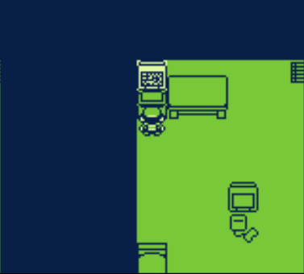
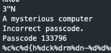
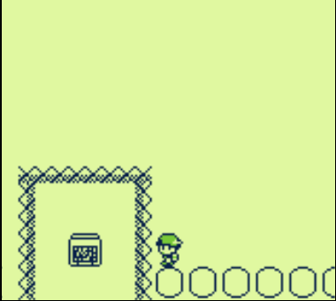
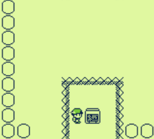

## Challenge 1

Flag: `SC5{h4ck3rm0n-1337}`

After the brief intro, you're dropped in a room with a computer in the top left corner that prompts you for a password.

The password is stored as ASCII in the program memory, and it exists uncompressed in the ROM file. Simply `strings challenge.gb`, and comb through the output by hand.

## Challenge 2 

Flag: `SC5{ch34t-f1nd3r}`

Completing challenge 1 will unlock challenge 2. Go outside, then at the bottom, there's a floating computer monitor that cannot be accessed by foot. You will have to swim... with HACKS!

The trick is to modify the byte in memory that represents the position of the player. In RAM, the address is: `0xCOBB`

Players can discover this by using an emulator with a memory viewer or debugger. A cheat finder may work, too.

I found that an easy way to modify the byte is to enable a Gameshark cheat. But first, position yourself so that you're aligned horizontally with the computer monitor.

Then, enable the following Gameshark cheat: `0105BBC0`

The above cheat means: Change byte at VRAM bank (`01`) to `05` at address `0xC0BB`. Note that in the cheat code, the low-byte of the address comes first.

If successful, you will be placed right on top of the computer monitor, whereupon you can interact with it and get the flag.
